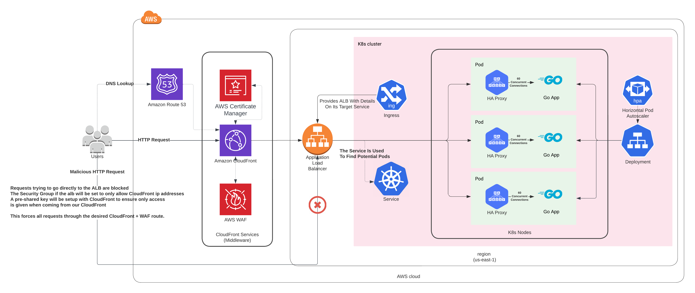

# Birthdays API

## Key Points

- Built using GoLang
- Deployed using Docker + Kubernetes
- Throughput throttled and protected from spikes of load that the autoscaler can't handle to some extent through the use of HAProxy
  - This somewhat mitigates small DoS/DDoS attacks as well, by throttling requests to keep the app alive, instead of it falling over
    - Falling over may be what you want if your app is fairly small, you may not want the increased costs of scaling to meet a DoS/DDoS attack or other kind of unexpected spike
- Autoscaling setup using Kubernetes HPA's
- All data stored in Redis
- Full test suite tetsing both the individual handlers as well as the HTTP server
- OpenAPI Specification
- Kubernetes overlay for AWS and ALB
  - Various configuration changes made to work better in an AWS environment
  - Zero downtime deployments and scaling
  - Will instruct Kubernretes to make a best attempt at providing a highly available setup
    - Pod affinity is configured to attempt to put pods for the application on separate nodes when possible
    - TopologySpreadConstraints are setup to make a best attempt at spreading the application across zones where possible
- Minimal Docker image built on Scratch to ensure security and footprint
- API response time < 3ms on average
- In-Memory based caching to ease load on backend storage service

## Deployment

A docker image is already build and hosted using GitHub packages (ghcr.io).

A setup has been provided for a Kubernetes cluster without needing any modification. This setup can be used by deploying the `aws` overlay.

Be sure to edit `./k8s/overlays/aws/ingress.yaml` to use a domain you have access to.

```shell
kubectl -n <my_namespace> -k ./k8s/overlays/aws
```

This makes the following assumptions:
- You have a Kubernetes Cluster in AWS (EKS or other) running Kubernetes 1.24
- You have ExternalDNS running and configured to use Route53
- You have AWS Load Balancer Controller running and configured
- You have at least 1 node group (or alternative if using Karpenter or Fargate)
- It is safe to use a storage mechanism that is volatile (non-clustered redis)
  - If you wish to have a more robust storage solution, deploy a clustered setup of redis (aws provide one of these, or deploy a redis cluster to kubernetes) and configure the app to talk to it using the below mentioned env variables

You can then access the application using the ingress you have configured via the domain you have provided.

If you are unable to use a domain and ingress, you may use port-forwarding to access the service.

```shell
kubectl -n <my_namespace> port-forward svc/birthdays-api 8080:8081
```

You can then browse to the app running at `localhost:8080`.

### Config

The app assumes sensible defaults for all config values, but these are all configurable either via command line arguments when running the binary, or via env variables.

| Setting        | Argument        | Env Var        | Examples                                     |
|----------------|-----------------|----------------|----------------------------------------------|
| Server Port    | -port           | LISTEN_PORT    | `8080` `5500`                                |
| Redis Host     | -redis_host     | REDIS_HOST     | `localhost:6379` `redis.some_namespace:6379` |
| Redis Password | -redis_password | REDIS_PASSWORD | `P@5Sw0rD123`                                |
| Redis Database | -redis_db       | REDIS_DB       | `0` `1`                                      |
| Cache Duration | -cache_duration | CACHE_DURATION | `5s` `1h` `5d`                               |

# Production Architecture

The above described deployment only covers running the application in a development environment.
This is not ideal, as it simply just exposes the pod to the outside world using an alb.

To make this production ready, we would look at building on the below extra config, likely through Terraform and deployed throguh a CI/CD pipeline instead of manually.

The production infrastructure includes:
- A CDN setup to provide caching
  - If caching is not used, the CDN still provides a good benefit by onboarding the user into the AWS network sooner, leading to quicker response times regardless of any caching
- A WAF setup within the CDN
  - This allows additional security config such as blocking specific bots, protecting against OWASP top 10 threats, and so on
  - This also allows additional features such as advanced DDoS protection and 3rd party managed WAF management
- HTTPS configuration
  - The app would ideally be configured to serve HTTPS back to the user from CloudFront with a valid certificate
    - The connection between CloudFront, the ALB, and the HA Proxy container should also be served over HTTPS, but the certificate does not need to be valid
      - This ensures encryption at all network transit points, and the data is only unencrypted when it reaches the pod within Kubernetes (which shares a local network with its containers)

The production architecture would look something like this:

